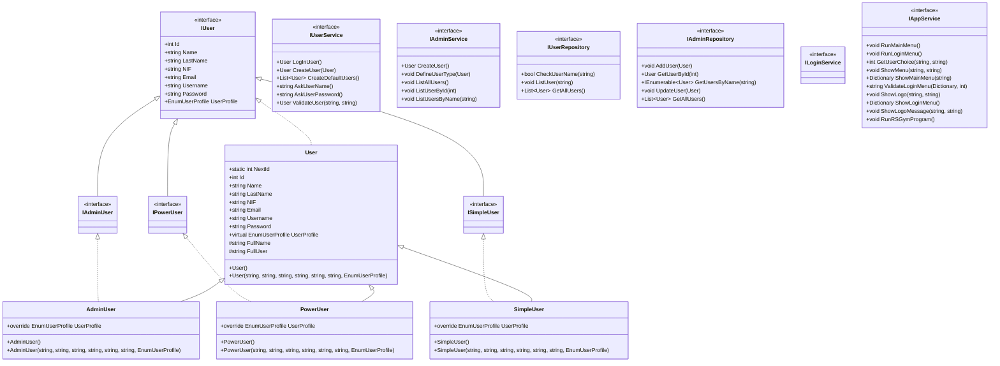
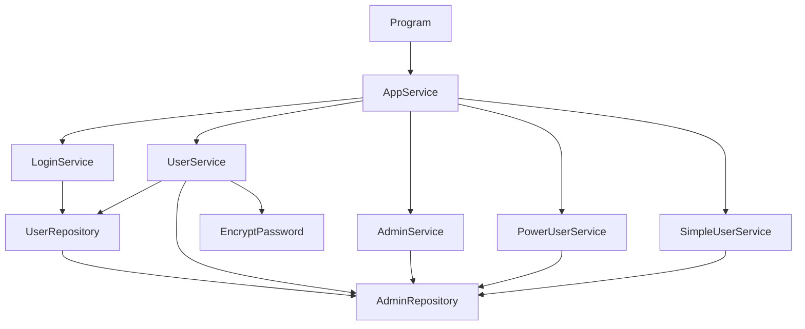

# RSGym Management System

## Project Summary
A comprehensive C# console application for gym management featuring user authentication with multiple role types (Admin, PowerUser, SimpleUser), service-oriented architecture, repository pattern implementation, and clean code practices. The system follows SOLID principles with a focus on separation of concerns and maintainable, extensible code.

## Key Technical Highlights

### Architecture & Design
- Layered architecture (Presentation, Service, Repository, Model)
- Interface-based programming
- Dependency injection pattern
- Repository pattern implementation
- Service layer abstraction
- Clean code practices

### Object-Oriented Features
- Inheritance
  - Base User class with derived role classes (AdminUser, PowerUser, SimpleUser)
  - Polymorphic behavior across user types
- Encapsulation
  - Private fields with public properties
  - Expression-bodied members
  - Data validation within models
- Polymorphism
  - Interface implementations
  - Method overriding for specific behaviors
  - Virtual properties
- Abstraction
  - Interface-based design
  - Service abstraction
  - Repository abstraction

### C# Implementation Features
- Property Features
  - Auto-implemented properties
  - Expression-bodied properties
  - Virtual properties
- Method Features
  - Extension methods
  - Method overloading
  - Input validation
- Modern C# Syntax
  - String interpolation
  - LINQ for data querying
  - Pattern matching
  - Static utilities

### User Management System
- Role-based authentication
  - Admin users
  - Power users
  - Simple users
- Security features
  - Password encryption
  - Input validation
  - Login verification
- User profile management
  - User creation
  - Profile validation
  - User listing and searching

### System Features
- Console-based UI
- Multi-layered authentication
- Input validation
- Error handling
- User-friendly interfaces
- Data persistence
- Scalable architecture

## Class Diagram


## Service Architecture


## Technical Requirements
- .NET 6.0 or higher
- C# 10.0 or higher
- Console Application
- Visual Studio 2022

## Project Structure
```
RSGym/
├── Program.cs
├── Enums/
│   └── EnumUserProfile.cs
├── Interfaces/
│   ├── IModels/
│   │   ├── IUser.cs
│   │   ├── IAdminUser.cs
│   │   ├── IPowerUser.cs
│   │   └── ISimpleUser.cs
│   ├── IServices/
│   │   ├── IAppService.cs
│   │   ├── ILoginService.cs
│   │   ├── IUserService.cs
│   │   ├── IAdminService.cs
│   │   ├── IPowerUserService.cs
│   │   └── ISimpleUserService.cs
│   ├── IRepositories/
│   │   ├── IUserRepository.cs
│   │   └── IAdminRepository.cs
│   └── IMethods/
│       └── IEncryptPassword.cs
├── Models/
│   ├── User.cs
│   ├── AdminUser.cs
│   ├── PowerUser.cs
│   └── SimpleUser.cs
├── Services/
│   ├── AppService.cs
│   ├── LoginService.cs
│   ├── UserService.cs
│   ├── AdminService.cs
│   ├── PowerUserService.cs
│   └── SimpleUserService.cs
├── Repositories/
│   ├── UserRepository.cs
│   └── AdminRepository.cs
├── Methods/
│   └── EncryptPassword.cs
└── Utility/
    └── RSGymUtility.cs
```

## User Credentials
The system comes with the following pre-configured users:
- Admin: Username: `melmag`, Password: `123456`
- Power User: Username: `paumag`, Password: `123456`
- Simple User: Username: `clasou`, Password: `123456`

## Installation Steps
1. Clone the repository
   ```bash
   git clone https://github.com/yourusername/rsgym-management-system.git
   ```
2. Navigate to project directory
   ```bash
   cd rsgym-management-system
   ```
3. Open solution in Visual Studio
4. Build the solution
5. Run the application

## Usage
1. Start the application
2. At the login screen, enter your credentials
3. Navigate through the menu system using numeric options
4. Perform operations according to your user role permissions

## Features by User Role

### Admin User
- Create, update, and delete users
- Manage all system aspects
- View all system reports
- Configure system settings

### Power User
- Create and manage gym members
- Manage training sessions
- Generate reports
- Limited administrative capabilities

### Simple User
- View personal information
- Basic system interactions
- Limited view-only access

## License
Copyright (c) 2024 Claudia Souza
All rights reserved.

## Contact
Claudia Souza
Project Link: [https://github.com/yourusername/rsgym-management-system](https://github.com/yourusername/rsgym-management-system)
